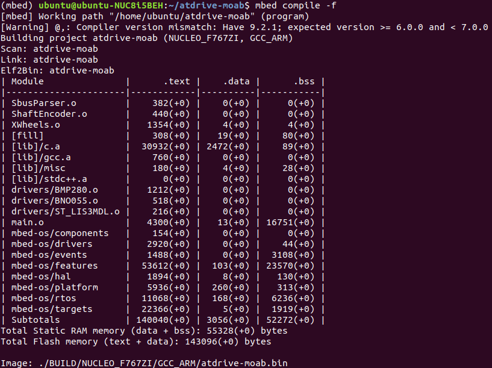

# About atdrive-moab

This repo is forked from the original atdrive-moab developed by Mark Fassler, please follow the link [here](https://github.com/mfassler/atdrive-moab) for the original source code. You can simply check on the notepad file "howto-build-mbed-os-on-linux.txt", which was wriiten by the original developer.

The step below is for
1. User who want to develop atdrive-moab on Ubuntu machine
2. User who has some basic of coding skill C++, Python
3. User who doesn't have much experience on Linux but want to

For a professional user such as ARM developer, Software developer, or High experienced software engineer, please feel free to do it your own way for an installation and build process, and just skip to User Guide section.

The default branch of this repo is coded for XWheels (Brushless hub wheels) with a skid-mode type,for the steering type please check on master branch of [Mark's repo](https://github.com/mfassler/atdrive-moab).

The purpose of this project is to create a UGV controller which has an IO for low-level communication such as SBUS, GPS, RC-servo, etc., and Ethernet for high-level communication to an autopilot PC such as Intel NUC, NVIDIA Jetson, etc. Those autopilot PC will take care on Autopilot script, Navigation system, and AI integration.


The original MOAB is shown as below


## Installation
atdrive-moab is developed on mbed-os, we are highly recommended to have a look on mbed-os [Installation and setup page](https://os.mbed.com/docs/mbed-os/v5.15/tools/installation-and-setup.html) for more detail. In this repo we will focus on the Mbed CLI, feel free to choose any of your favourite way to build the project.

### Linux
You can choose any Linux distro for the development as you like, the installation step below is done on Ubuntu 18.04, feel free to adjust the command to match with your distro. Let first install basic dependencies by this command on your terminal

`sudo apt install python2.7 python-pip git mercurial`

#### virtual environment
It is suggested to install Mbed CLI from virtual environment, this will ensure that changes made by Mbed CLI installation do not propagate to the rest of your system and cause unexpected changes in any existing Python installation. And this is kind of good manner to work with Python related. Please follow the command to install from this [link](https://virtualenvwrapper.readthedocs.io/en/latest/install.html) or following the step below.

`sudo pip install virtualenvwrapper`

open .bashrc script from your terminal from this command `sudo gedit ~/.bashrc` and add these three lines at the bottom of the script.

```
export WORKON_HOME=$HOME/.virtualenvs
export PROJECT_HOME=$HOME/Devel
source /usr/local/bin/virtualenvwrapper.sh
```

save and close gedit. On the same terminal run this command `source ~/.bashrc` to reload your .bashrc 

then make a new virtual environment from this command 
`mkvirtualenv mbed`
you can change `mbed` to any name you want. To start working on new environment, run this command `workon <your env name>`, replace `<your env name>` with your created one. Now you will see there is a (mbed) in front of your username on the terminal. You are now working on virtual environment which name `mbed`, and to come back to system environment you can run `deactivate` .


#### Mbed CLI
From the virtual environment, you can easily install Mbed CLI with  `pip install mbed-cli` and to verify Mbed CLI installed correctly, run `mbed --help`, it should print out how to use it. To update Mbed CLI, run this command `pip install -U mbed-cli`

#### Compiler
There are many compiler that available from [manual-installation page](https://os.mbed.com/docs/mbed-os/v5.15/tools/manual-installation.html), here we will use gcc-arm as a toolchain.
Download the tar file from [developer.arm.com](https://developer.arm.com/tools-and-software/open-source-software/developer-tools/gnu-toolchain/gnu-rm/downloads), on the present time, the version is gcc-arm-none-eabi-9-2019-q4-major-x86_64-linux.tar.bz2

After the file downloaded, bring it to your home directory and extract the file. Inside gcc-arm-none-eabi-9-2019-q4-major you will see "arm-none-eabi" , "bin" , "lib" , "share" which meant you correctly did it. 

Then you may need to add the tool chain to your path by open .bashrc `sudo gedit ~/.bashrc` and copy this line
`export PATH=$PATH:/home/<username>/gcc-arm-none-eabi-<your downloaded version>/bin/` and paste at the end of the .bashrc file. Don't forget to change `<username>` and `<your downloaded version>` to your proper one. 

Reload you .bashrc by run this `source ~/.bashrc`

or alternatively way you can config the compiler path to let the mbed knows by run this command

`mbed config -G GCC_ARM_PATH "/home/<username>/gcc-arm-none-eabi-<your downloaded version>/bin/"`


## Getting Started
After the installation processes and without any error, it's time to test some simple program to make sure that our Mbed CLI and compiler are properly installed. You can also walk through the step from this [link](https://os.mbed.com/docs/mbed-os/v5.15/tools/working-with-mbed-cli.html) or follow us here.
From your home directory (or anywhere you want to create the project), let make the new project by run this command 

`mbed new test-mbed-program`


This creates the project name `test-mbed-program` and initializes a new project with the latest `mbed-os`. You can check on the version of `mbed-os` by first enter to that directory

`cd test-mbed-program`

`mbed ls`


Our atdrive-moab is developed on NUCLEO_F767ZI board with our custom shield to put on top of it. Let try take out the shield from the NUCLEO board, and switch the jumper JP3 to U5V, so the pin will get power from USB port (normally, we will use E5V, with the shield on it). The board should look like this 


Then plug the micro-USB at CN1 of NUCLEO to your pc. We can set the target board according to each project, but we always use NUCLEO_F767ZI all of the atdrive-moab product, so let set the target board as this one by this command 

`mbed target NUCLEO_F767ZI` 


set the toolchain for this project by this command

`mbed toolchain GCC_ARM`


If everything is fine, try make some simple heartbeat code by run `touch main.cpp` to create empty file, and open it up and copy and paste this code to there.

```
 #include "mbed.h"

 DigitalOut heartbeat(LED1);

 int main() {
     while (1) {
         heartbeat = 1;
         wait(0.5);
         heartbeat = 0;
         wait(0.5);
     }
 }
```
You can find other examples and how to use those APIs from [here](https://os.mbed.com/docs/mbed-os/v5.15/apis/index.html).
Save, close the script, and run `mbed compile`. Because we already set toolchain and target board already, so everytime we compile, it will automatically look for the GCC_ARM and the target board that we set. Finally, if there is no error, we can try run `mbed compile -f` to flash the compiled code to the board. 
If you see the LED1 blinking at 2Hz, so you have success to build a code on mbed-os! Now let move to more advance code on atdrive-moad source code.


## Build atdrive-moab source code

From you home directory (or any project dir), clone this repo with 
`git clone https://github.com/rasheeddo/atdrive-moab.git` 
or using mbed command 
`mbed import https://github.com/rasheeddo/atdrive-moab.git`. 

You will notice that there is no `mbed-os` in there, just run the following command to add mbed-os to this project
`mbed add mbed-os` or `git clone https://github.com/ARMmbed/mbed-os.git`, 
then go into that directory by `cd mbed-os/` . To make sure we are in the same page, same version, you have to change the version of mbed-os as our code requires. 
Run this commned `git checkout mbed-os-5.4.0-rc1-17413-g38a8c0e` to let your mbed-os version similar to us. We better to insall some requirements according to this version by run this `pip install -r requirements.txt` . After that, return to your absolute project path by run `cd ..` , so your currect directory should be `atdrive-moab`. 

Next step is to compile the code and flash to NUCLEO board. I think it's time to plug the shield back to NUCLEO board and don't forget to switch JP3 back to E5V. We are going to provide external power on POWER_IN XT30 connector. Your current setup should look like below, then plug the USB from NUCLEO board to your PC.


Run `mbed compile` to just compile the code, and `mbed compile -f` to compile and flash. If everything is going fine, your terminal should look like this.



You can see that LED2 on the shield is blinking that indicates us all the code is running. Now you can unplug USB from the NUCLEO board. 


## Debugging

### LAN port
To monitor what's going on, you can use `u_printf()` function to print out some value or message you want to observe, see some example of how to use this function on `main.cpp`. Note that you need to plug the ethernet cable on the MOAB board (NUCLEO + shield = moab) and also set the ROBOT_CONFIG.hpp file as the proper one.

For example my office LAN is `192.168.0.xx`, so you can see I have `ROBOT_CONFIG_XDRIVE_OfficeLAN.hpp` file which contains the information of my network, so you can copy/edit this file according to your LAN setting. Then we need to make a soft link from that config file to the new `ROBOT_CONFIG.hpp` file by the command below.

`ln -s ROBOT_CONFIG_XDRIVE_OfficeLAN.hpp ROBOT_CONFIG.hpp`

make sure that `_AUTOPILOT_IP_ADDRESS` is setup correctly. For in an office debugging, this should be your PC's IP. 

I plug ethernet cable to the MOAB board to access my office LAN, then from my PC with the same LAN, I can run `socat -u UDP-RECV:31337 stdout` on the terminal, to see the message from MOAB. You can put `u_printf("messages or variables you want to monitor")` to anywhere on the code in case you want to debug something. This technique comes from the original developer Mark Fassler.


**NOTE**
If you don't see anything printing on the terminal, there is a possibility that your firewall is enable. To disable please use this command.

`sudo ufw disable`


### UART port
Additionally, you can use USB port with Arduino's Serial Monitor. If you are familiar with Arduino development, then this is another option that you can monitor some messages or variables. On the MOAB's code (main.cpp, XWheels.cpp, or etc) you can try put `printf("message") or printf("rpmR: %f", %rpmR)` to monitor something.
First you need to install Arduino, then open the software, select the correct USB port for example /dev/ttyACM0 or etc, then open Serial Monitor. The baud rate to listen `printf()` is 1152000, if everything is setup correctly at least when you reset the board and the Serial Monitor is openning you should see this message from `eth_callback()` . I think this can give you a rough idea about how to debug when something goes wrong.


Or you can use another serial monitor such as [CoolTerm](https://freeware.the-meiers.org/).


## User Guide

Another repo that will help you workaround with atdrive-moab easily is [atdrive-moab-tools](https://github.com/mfassler/atdrive-moab-tools) which developed by Mark Fassler. Please clone the repo to your home or any project directory as this command 

`git clone https://github.com/mfassler/atdrive-moab-tools.git`

You will need these tools when working with GPS, SBUS, IMU, or etc. So I highly recommend to clone that repo to your autopilot PC such as Intel NUC or NVIDIA Jetson, and also clone it to your base station PC. I will explain more detail in each feature from an example.

**General Features**
- [SBUS](docs/user_guide/SBUS.md)
- [GPS](docs/user_guide/GPS.md)
- [IMU](docs/user_guide/IMU.md)
- [PWM](docs/user_guide/PWM.md)

**Brushless Wheels**
- [ATCart version1](docs/user_guide/XWheels.md)
- [ATCart version1 with KO-Propo](docs/user_guide/KO_propo.md)
- [ATCart odrive](docs/user_guide/odrive.md)

**DC Brushed Wheels**
- [attler2](docs/user_guide/attler2.md)

