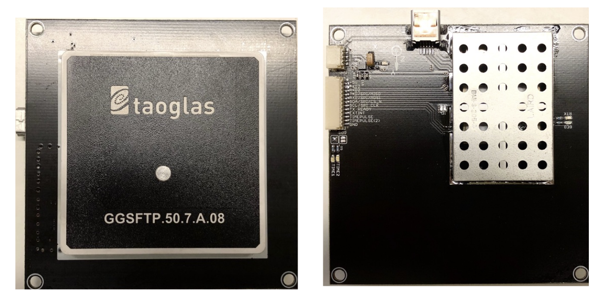
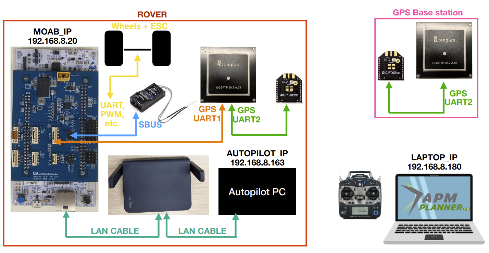
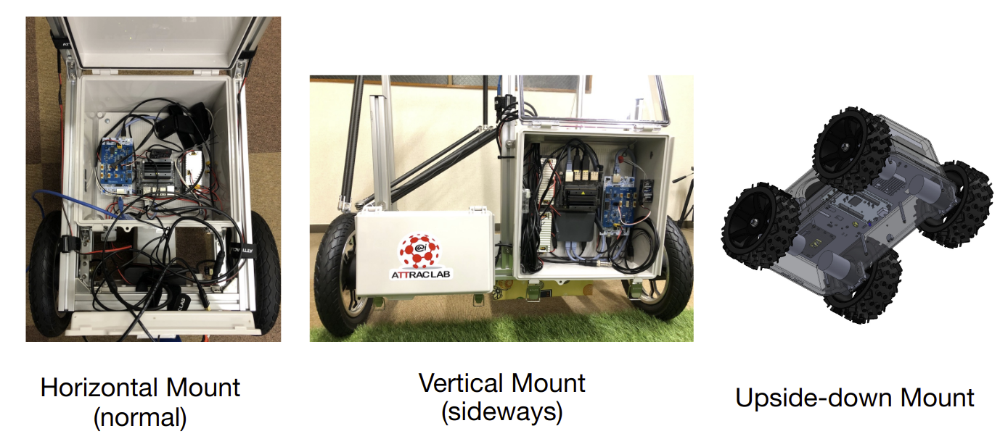
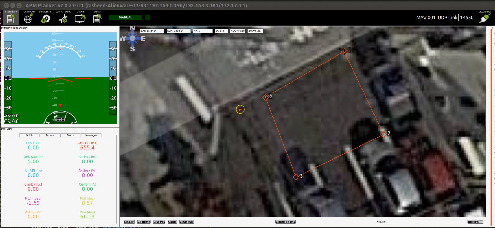
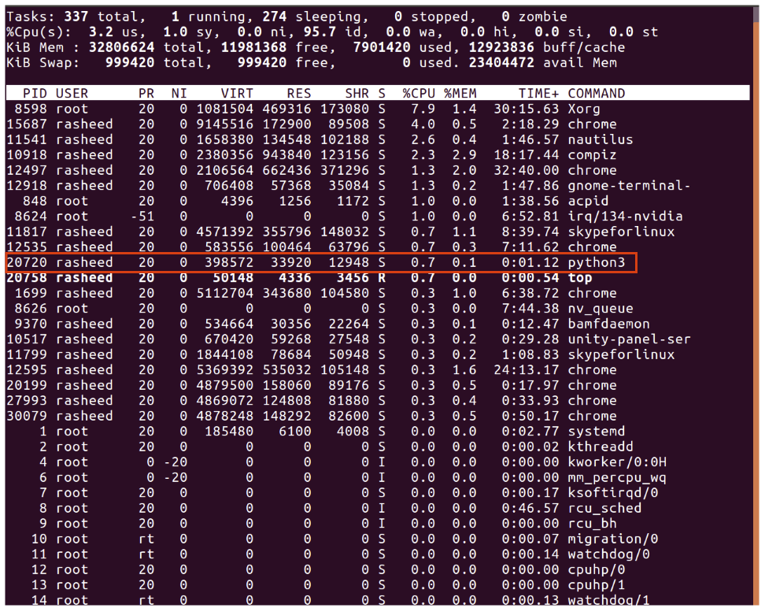

# GPS

## Hardware setup
AT-Drive MOAB uses ZED-F9P with taoglas built-in antenna for GNSS.

 

To check you have access to GPS system, first make sure we have the same setup as below.

 

The base station GPS is an option, in case you want to control the rover in such a precise scale, so you will need one more GPS module for base station. We have to transmit the data (RTCM3 corrections) wirelessly from base station's GPS to rover's GPS, one of the option shown in figure is to use XBee modules. I think this is the simplest way you can do it just buy two of XBee modules. Alternatively, Mark has developed the WIFI version which you need one more MOAB board on the base station instead of two XBees, we will update this setup in the future.

Connect all the cable as shown in the figure (also power line). I recommend to have the wheels and ESC module plugging on as driveable rover system, because we will need to calibrate the heading angle and it needs transmitter to control a rover in manual mode. 

## Software setup 

### Configure the script

On the `atdrive-moab` side, you may need to change `ROBOT_CONFIG.hpp` according to this setup, you can choose the IP addess of MOAB as you want. For the AUTOPILOT, you may need to check it first by checking on the router client's IP, or using `nmap` command on your laptop to discover the IP in this network, there are many ways to find the IP on the LAN, please choose the way you like. Then compile and flash `atdrive-moab` new firmware to the board.
Normally, the way I do the work is, from my laptop I can access into autopilot PC by `ssh`, and transfer the file by `scp` command. Previously, I suggest you to have a clone of `atdrive-moab-tools` on both autopilot PC and your laptop. Then from your laptop, on `atdrive-moab-tools` directory, you will need to create your own config file by copy the existing one and modify it,

`cp ROBOT_CONFIG.py ROBOT_CONFIG_<any_name>.py` , replace `<any_name>` with your project's name or anything.

Then open the file `LocationService.py`, from line 31 to 34, you will see

```
try:
    import ROBOT_CONFIG as config
except:
    import ROBOT_CONFIG_default as config
```

replace `ROBOT_CONFIG` with your config file for example `ROBOT_CONFIG_<any_name>`.

Another thing you need to consider is the orientation of your MOAB board. Let see the image below



Normally if the MOAB is mounted as holizontal, you can close the `LocationService.py` and do the next step. But if it is mounted sideways (vertical) or upside-down, you need to do something.
For upside-down mounted, you need to uncomment line 166, 167, 168 and 174 on `LocationService.py`.
For sideways mounted, you need to uncomment line 171, 172, 173 and 174 on `LocationService.py`.
Those lines are just doing matrix transformation, so basically, you will get 0.0deg as yaw angle when MOAB board is powered, otherwise it will give you negative random number which you won't prefer.

Then open your `ROBOT_CONFIG_<any_name>.py`, and edit the `MAVLINK_IP_ADDRESS` as your laptop, and `MOAB_IP_ADDRESS` as your MOAB setting. So the autopilot PC can know which address to send back the data to ground station.

After finished editing your robot configure file, you have to copy those files from your laptop to the autopilot PC by this command
```
scp LocationService.py ROBOT_CONFIG_<any_name>.py <autopilot_pc_name>@192.168.8.163:/<path_where_you_clone_atdrive-moab-tools>/`
```
keep in mind, you need to change `<any_name>` as you chose, and `<autopilot_pc_name>` as an example `nvidia` or somehting, and also `<path_where_you_clone_atdrive-moab-tools>` as an example `/home/nvidia/atdrive-moab-tools`. Please confirm all of these are set correctly.


### APM Planner 2.0
At the time of writing this manual, we are using APM Planner 2.0 as a ground station application. It uses MAVlink protocol to communicate between rover and the ground station control. I suggest to use v2.0.27-rc1 version, please check on this [link](https://discuss.ardupilot.org/t/apm-planner-2-0-27-rc1/35510) and download deb package for Ubuntu system.


## Start!
Put your rover somewhere with an opened sky and have some area, turn on your RC transmitter and make sure you can control it in manual mode. On you laptop, open APM Planner, it is okay if it doesn't connect yet, it will connect as soon as we start the `LocationService.py`. Then on autopilot PC, run `python3 LocationService.py` from atdrive-moab-tools. You will notice that the upper right corner icon turned to green which means connected, and you can see your rover pop out as the image below. (You won't have the waypoints yet, that's fine!)



Then you have to drive the rover manually in straight line until the heading angle of rover point to the same direction as that line.
This method is using IMU data with GPS data to find the correct heading angle, you can find more detail on `LocationService.py` script.

Now you can go to `FLIGHT PLAN` tab mark waypoints as you want, then finally you can click `Write` on the lower left side panel to send those way points to the rover directly or you can check out the mission file by click `Save WPs` on the lower right side panel. The file contains some informations about mode, but I think we do care just Latitude and Longitude values. You can create any of autopilot script according to these waypoints, for example, go to each waypoints and return home, go to this point, stop and do some mission, etc, that's the autopilot script that you need to workaround.


## MORE TIPS
Practically, on autopilot PC, `LocationService.py` should run on the background which means even the ssh connection is lost from our laptop to the autopilot PC, the process is still running. There are many ways to achieve that, I normally use 

`nohup python3 LocationService.py > output.log &`, 

so even the terminal is closed, the process is still running on the autopilot PC, you can see the output by use this command 

`cat output.log` 

or live monitoring by `tail -f output.log`. 

To stop the script in the background, use `top` command and enter. You will the running process, keep your eyes on `python3` and look what is the `PID` number, remember that, and `CTRL-C` out of that. Then use this command to kill the running process, in my case `kill 20720`.

