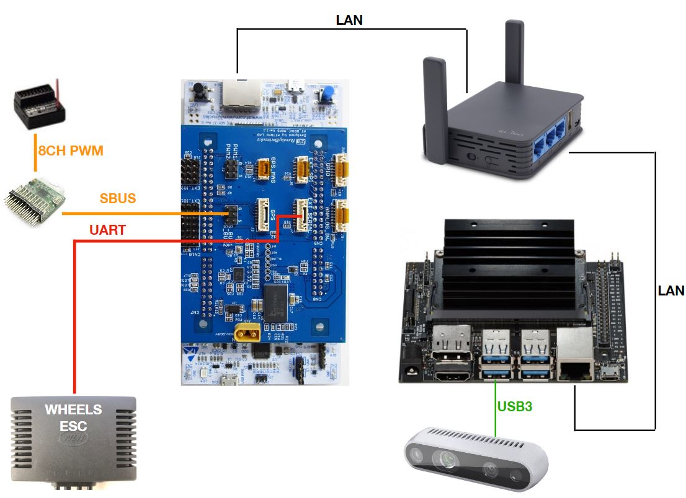
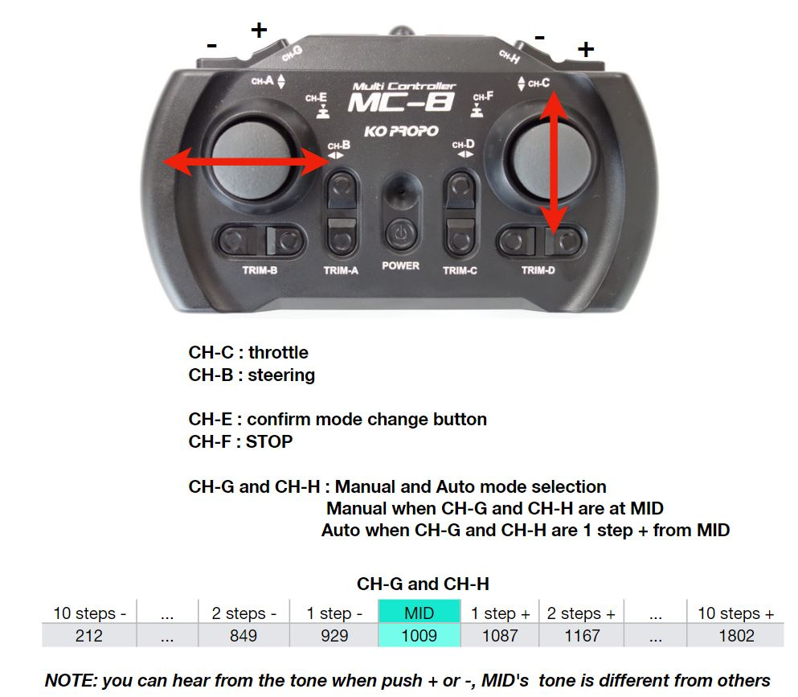

# ATCart v1 x KO Propo

Normally, we are using Futaba transmitter as I explained in [here]((docs/user_guide/SBUS.md)), but we can use another transmitter for example [KO Propo](https://www.kopropo.co.jp/en/products/view/80710). In order to use this RC transmitter/receiver with MOAB board, you have to use PPM/SBUS converter module like the [S2PW](https://hobbyking.com/jp_jp/signal-converter-module-sbus-ppm-pwm-s2pw.html?countrycode=JP&gclid=EAIaIQobChMItPCg2avF6QIV1cEWBR2-6ge3EAQYAiABEgKt1fD_BwE&gclsrc=aw.ds&___store=jp_jp). It can convert PPM to SBUS or vice versa.

In our case, we need to plug each channel of KO-Propo's receiver to each channel of S2PW, and bring the SBUS-out of S2PW connect to MOAB's S_BUS1 as usual.

Please checkout `atdrive-moab` -> `ko-propo` branch to get the source code. As a default setup, the throttle and steering are separated as two sticks. To change the mode to auto, manual or stop, it's a little bit tricky, because this transmitter is not like a holding ON/OFF switch, but it works like push button for CH-E and CH-F, and works like incremental switch for CH-G and CH-H. Mode changing of Futaba and KO-Propo are totally different. Let check on the image below.

You can check out the video below on how to change the mode and manually control on ATCart with KO Propo. I have explained it in every detail on how to switch the modes.

The other setup is similar to [ATCart v1 with Futaba](./XWheels.md).