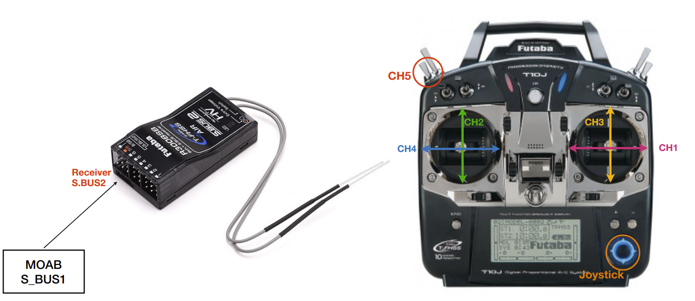

# SBUS

SBUS is a protocol which developed by Futaba to communicate between multiple servo and Futaba RC transmitter only just a single control line. On MOAB moab, there are S_BUS1 and S_BUS2 pinout that you can use for your Futaba RC transmitter or connect to a Futaba servo as you want. Normally, we are using S_BUS1 to receive a signal from Futaba receiver. Some basic rules that we use is, CH5 is for mode-changing, on transmitter it is indicated as "E". 

You can go check it by press and hold "+" button to enter menu. Then use a joystick to choose "Servo" menu then push it to enter, try switching each channel and see the result of bar graph. If CH5 is on wrong switch, you can back to the menu by press "END" button, then select "AUX Channel". On CH5 you can push "+" or "-" to change the switch for CH5, so we want it to be "SwE". After that just press "END" two times to back to the main page.

If the transmitter is setup correctly, you can see the LED1,2,3 on NUCLEO board changes color according to each mode.

If your are following from the **Debugging** section, I think your `ROBOT_CONFIG.hpp` file, your `_AUTOPILOT_IP_ADDRESS` should be your PC's IP, and I assume you already clone `atdrive-moab-tools` already. We can simply test reading SBUS value and let it print out each value of channel by using testing tools

`cd atdrive-moab-tools/testing_tools/` 

`python3 host_sbus_listener.py`

your terminal will print all of your SBUS value, so you can debug or adapt this script to your work if you want to get information of SBUS on your autoplilot script.

**NOTE**
If you don't see anything printing on the terminal, there is a possibility that your firewall is enable. To disable please use this command.

`sudo ufw disable`
