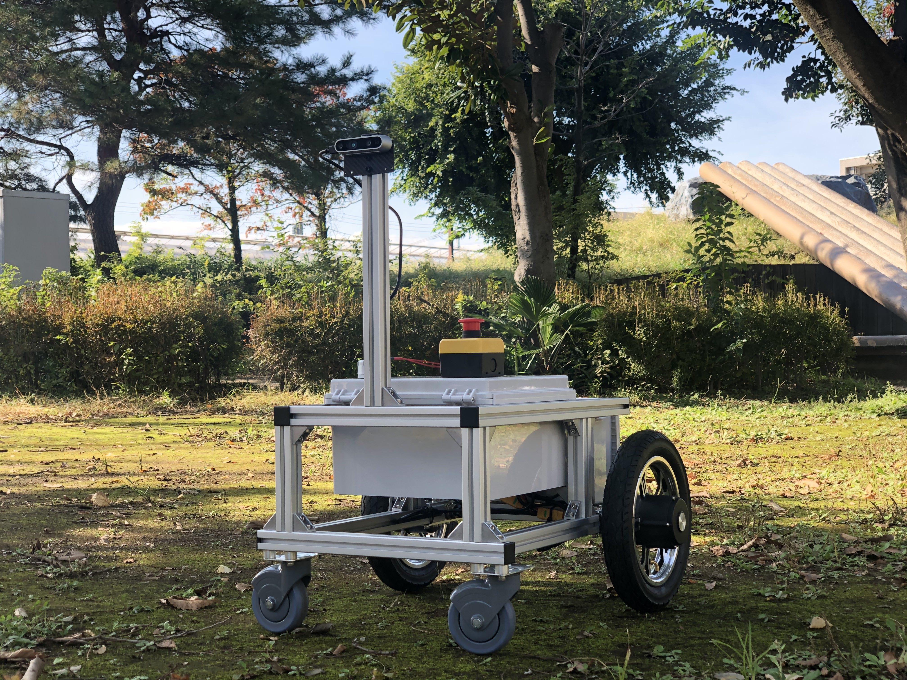
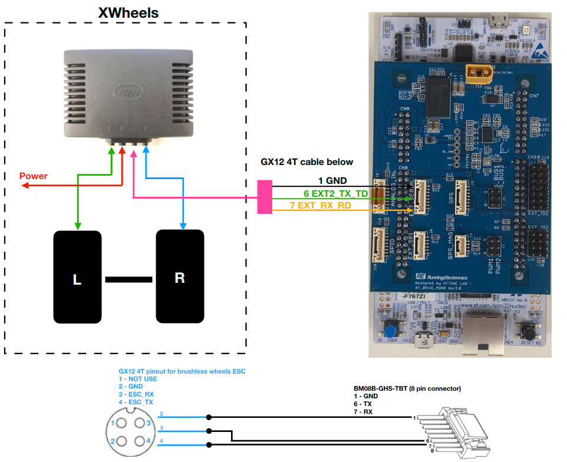
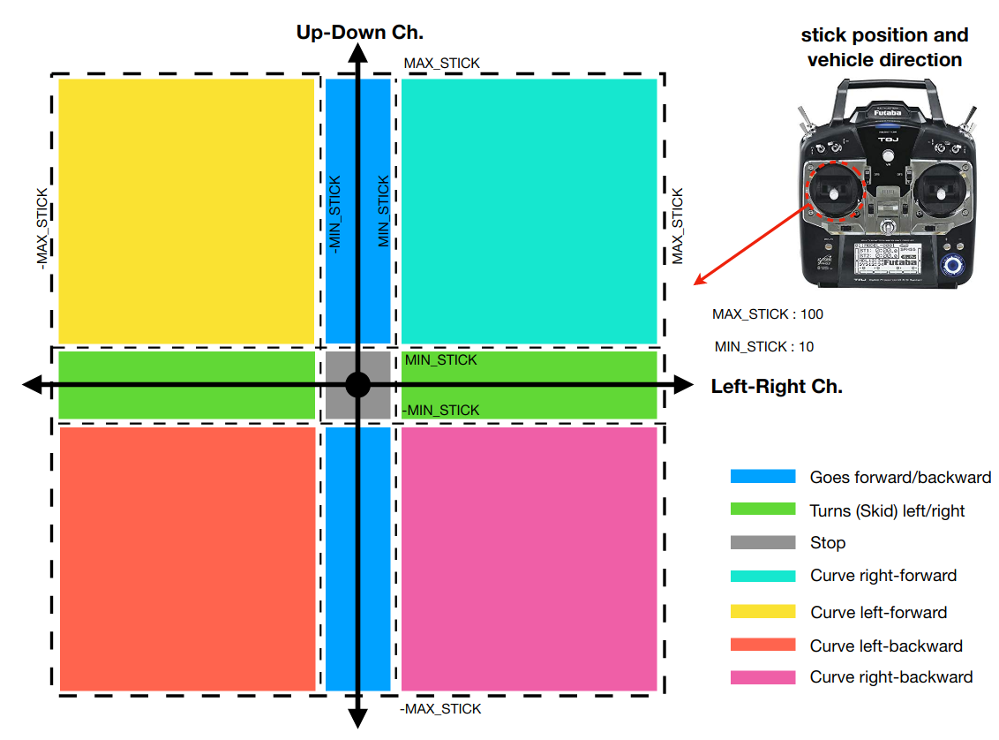

# ATCart v1

ATCart version1 is used XWheels for a drive unit.

 

XWheels is a brushless hub motor comes with their own ESC. It was designed to use for an electrical wheel chair, so it has its own remote controller in the package. I did reverse engineering on the control packets, please check the detail on [here](https://github.com/rasheeddo/BrushlessDriveWheels).

To use XWheels with MOAB, please follow the wiring setup below. 

 


We can let MOAB mimics the initialization process and command packets, similarly with the existed remote controller. So please checkout on `atdrive-moab` -> `master` branch. 

Top speed of this wheel is around 144 rpm. There is no feedback out from the ESC, but there is hall sensor inside the wheel hub. So if you have another ESC that can read hall sensor and drive BLDC, it's possible to use it.

There are several project that ATCart was rolling on please check on these videos below.

**Indoor Navigation**

[](https://www.youtube.com/watch?v=LtY2LuMBwus)

**Chestnut picking robot**

[](https://www.youtube.com/watch?v=K227r_H5E2g)

**Human following robot**

[](https://www.youtube.com/watch?v=-OnOI6hBKCQ)

As you know, the cart is differential drive, so it's skid-type. I am basically using one stick of transmitter to control all of the motion, let see the image below

 

It's quite straight-forward for push up-down or left-right to make the robot goes forward, backward and skidding accordingly, moreover, you can drive it in nicely curve by pushing the stick in diagonal.

The left stick is CH2 for up-down and CH4 for left-right, if you want to use two sticks separately, you just need to change the channel on `main.cpp` of `atdrive-moab`. Let take a look from line 169 as a code below

```
void set_mode_manual() {
	myledR = 0;
	myledG = 1;
	myledB = 0;
	
	drive.vehicleControl(sbup.ch2, sbup.ch4, motorRPM);
	drive.setRPMs(motorRPM[0],motorRPM[1]);
	sbus_a_forImuPacket = sbup.ch4;		// sbup.ch1; steering
	sbus_b_forImuPacket = sbup.ch2;		// sbup.ch3; throttle
}

void set_mode_auto() {
	myledR = 0;
	myledG = 0;
	myledB = 1;

	drive.setRPMs(rpmR,rpmL);
	sbus_a_forImuPacket = sbup.ch4;		// sbup.ch1; steering
	sbus_b_forImuPacket = sbup.ch2;		// sbup.ch3; throttle
}
```

As you see you can change anywhere that written `sbup.ch2` and `sbup.ch4` to the channel you want to use, for example channel 1 as `sbup.ch1`.


You can follow how to simply test auto mode from [here](https://github.com/rasheeddo/ATCart-setup#testing-auto-mode)
