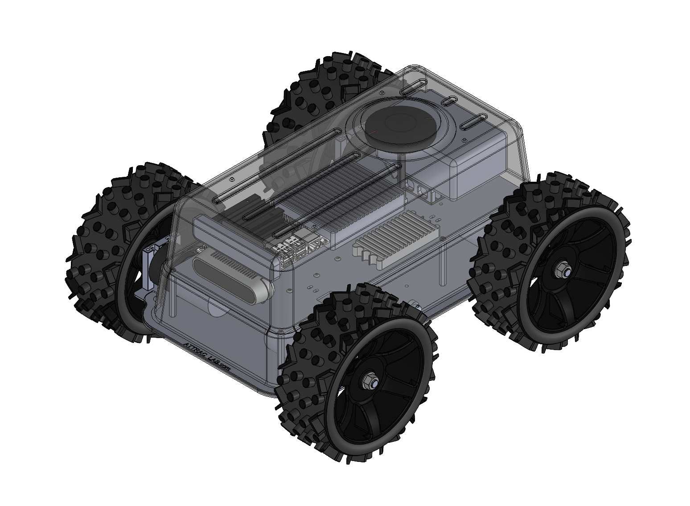
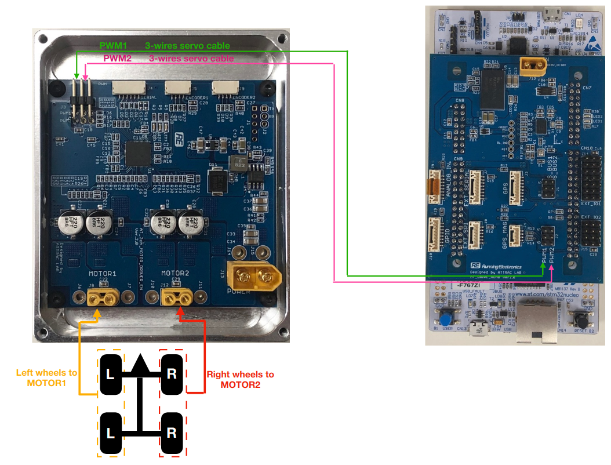

# Attler2

Attler2 is a miniature size UGV 4-Wheels drive. It is operated as skid-type rover, suitable for indoor and outdoor application for development kit AI-UGV-Navigation system.

 

It is driven by 2-channel PWM driver board see the setup below.

 

So it's generally similar to any ESC with the skid-type rover, we just generate PWM signal from MOAB, and plug the cable to the ESC's PWM pin. If you another ESC or another DC motor, you can use the same method, but just swap the hardware as you want.

Please checkout the `atdrive-moab` -> `attler2` branch, the idea to control this rover is similar to XWheels due to it's a skid-type. In manual control, you can make it go forward / backward / skidding and curve similar to XWheels. Let see how it runs outside

But to use it with autopilot script, we need to send a percentage of wheel's rpm in both wheels instead of direct value. Because for a simple control loop, we don't have a feedback of the wheel, so if the autopilot script send `rpmR_percent = 1.0`, it meant full speed on the right wheel. So the range is `-1.0 <-> 0.0 <-> 1.0`, minus sign means rotate in reverse direction, and the same mannner is applied to the left wheel.

Let see the stream of camera in front of Attler2 in human following mode here

