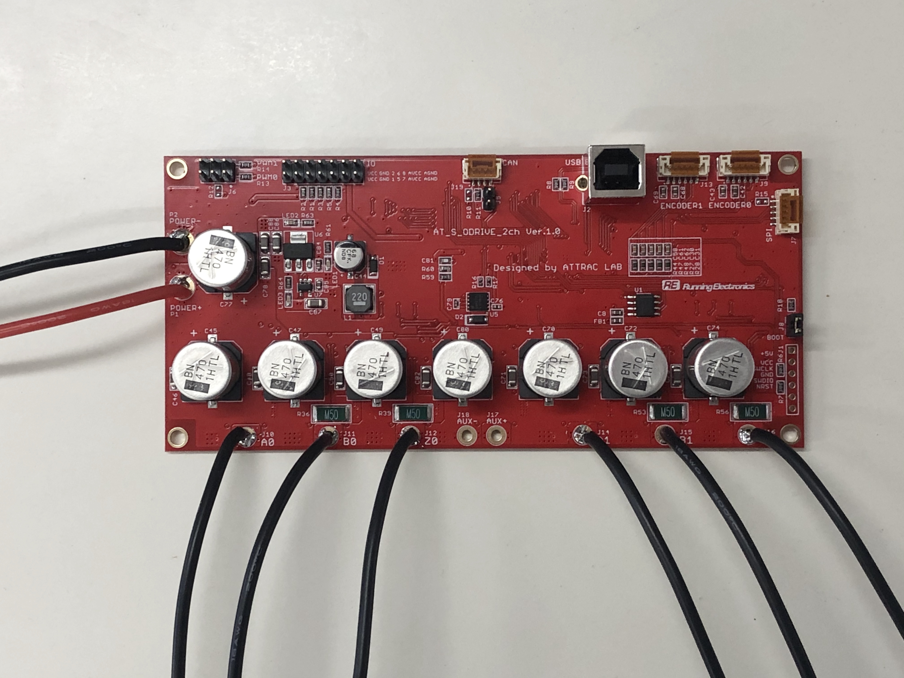
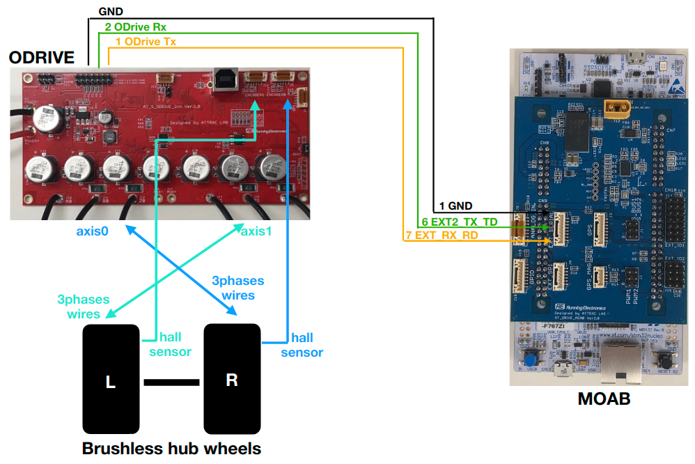

# ATCart x ODrive

ODrive is an open-source motor controller for robotics application. You will have to prepare the ODrive board with the latest firmware, install `odrivetool` and do some configure. Please check on how to install and initial setup from [this](https://docs.odriverobotics.com/). The `odrivetool` can help you quickly setup the motor, and test it before doing the real job. 

We made a custom ODrive board which should be exactly same as original board, check on this image below

 

If you are planning to use the ODrive with a brushless hub wheel, I highly recommend you to walkthrough some of the setup on the [ODrive hoverboard setup guide](https://docs.odriverobotics.com/hoverboard). It was well documented without any of my additional. You can check on this [text file](docs/user_guide/odrive_docs/two_wheels_init.txt) for a necessary command you may use a lot when setup new wheels, I gathered it all in one place, but keep in mind that your and mine parameters's value might be different.

On the hoverboard setup guide, it uses RC control on GPIO3 and GPIO4, but to use it with MOAB, we are going to use SBUS from MOAB and send a command via UART to ODrive serial port, so you may don't need to do the step on `PWM input` on that page. 

After the setup was done and you can control the wheel hub from `odrivetool` that means you got everything almost complete. Let checkout odrive branch of this repo to see the source code of MOAB. And check on the setup with MOAB below

 

The right wheel is for axis0 and left wheel is for axis1 of ODrive. The same UART as XWheels is used for ODrive, please confirm the wiring. The other components such as SBUS and GPS are same as XWheels's setup.

We are using UART communication to send ASCII protocol command to ODrive for more detail please checkout [here](https://docs.odriverobotics.com/ascii-protocol.html). The wheels are able to control in both velocity and position controls. As a default setup, ATCart will start with velocity control-mode, then we can change the control-mode manually by switch CH9 of our transmitter, it will take around 5 seconds to reboot the system, then you can push the same stick to control position of the cart, please check on this video

It's quite straight-forward for velocity control, but for position control as default `atdrive-moab` -> `odrive` branch firmware, when the transmitter stick is on middle that means the initial angle when start, you can change position mapping according to the stick in `odrive.cpp` and `odrive.hpp`, please check more detail in [this function](https://github.com/rasheeddo/atdrive-moab/blob/1cb750b9147b6e50ace1977fdc6b10b499bea931/odrive.cpp#L425). Those are some concern in manual mode.

Moreover, you can change the control-mode either from autopilot. Please check this [repo](https://github.com/rasheeddo/ATCart-odrive) for how to do it. So even in your manual mode is in velocity control, but you autopilot want to control in position control, when you switch back to auto-mode, it will automatically change the as you want.

This video below shows an application of using ATDrive MOAB and ODrive with Navigation system and AI integration.

**NOTE**
There is a possibility that your UGV might stop working during development process, because the ODrive board is quite sensitive to errors that may damage the motor or the board itself, if those things happen, don't immediatly reset the board but first grab a USB cable and plug to ODirve board and use `odrivetool` to see which error you got. The command you need is `dump_errors(odrv0)`. Please check on [ODrive page](https://docs.odriverobotics.com/troubleshooting) to see how to get rid of that error. You may need to adjust some parameters to solve that issue.